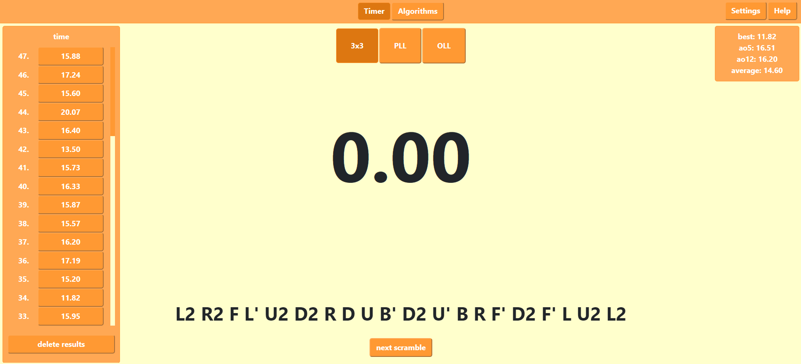
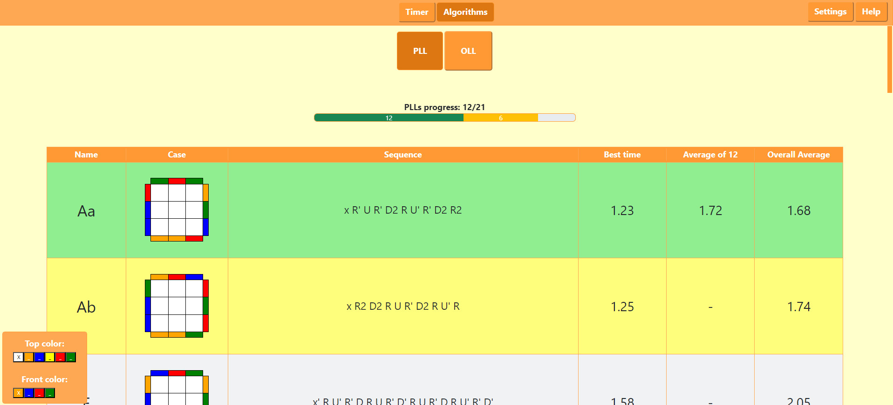

# Rubik's cube tool for training in React.js

## Usage

You can try this tool [here]().

## Features

- a
- b
- c

## User Interface

Timer tab:

Algorithms tab:

## Setup

Before setup you need to have Node.js installed on your pc.

1. Clone this repository via `git clone <url_of_this_repo>` command in Git Bash.
2. In console, run `npm install` in cloned directory to install required dependencies.
3. Then run `npm start` to start React.js application.
4. Go to http://localhost:3000/ in your browser and you should see working application.

## Inspiration

The inspiration for this project comes mainly from [csTimer](https://cstimer.net/) tool and from [jperm.net](https://jperm.net/) tool.
